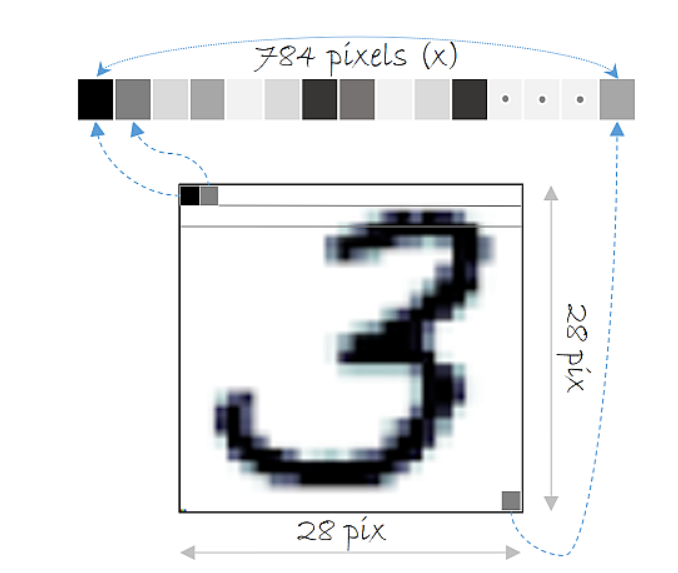
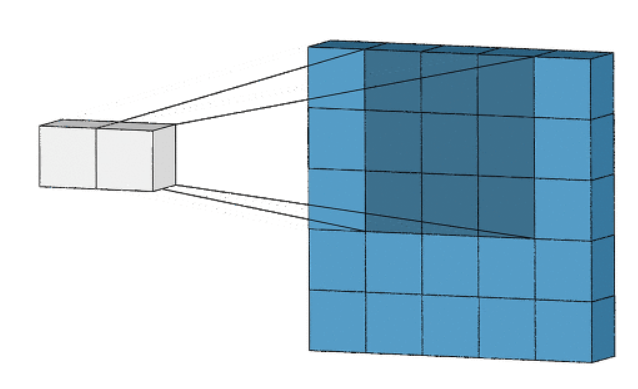
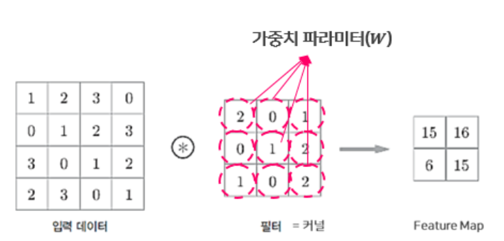
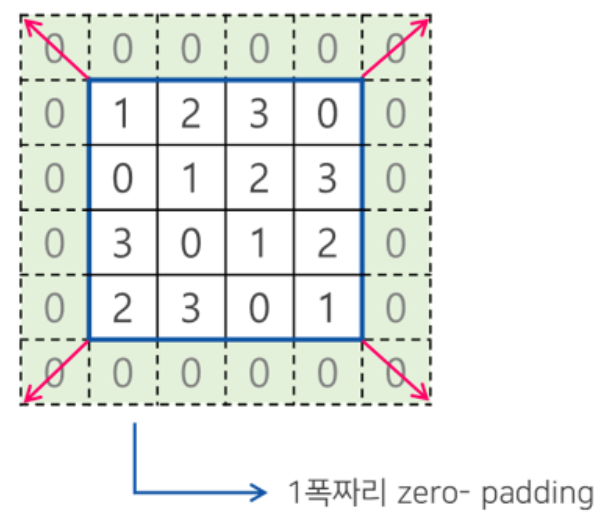
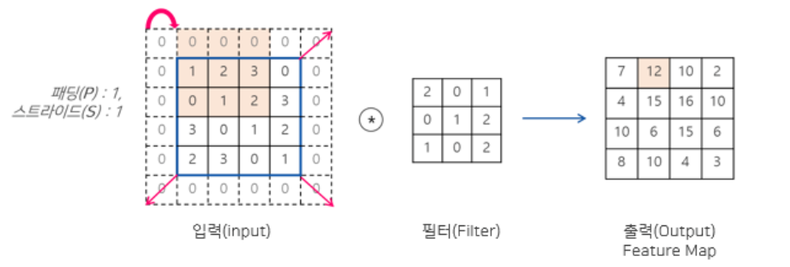
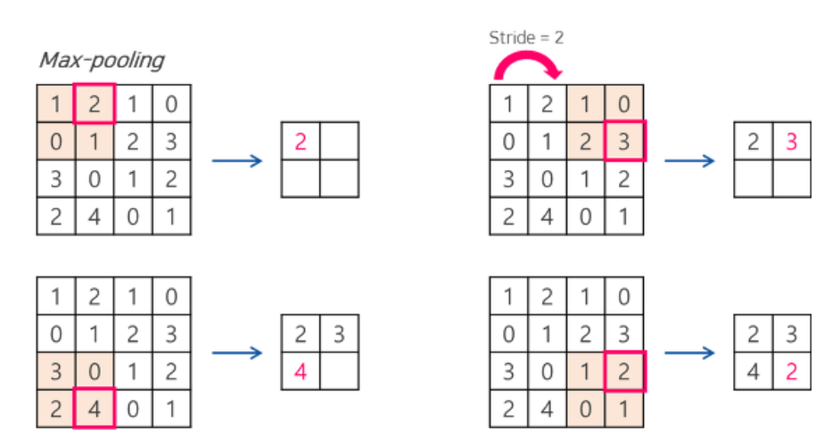
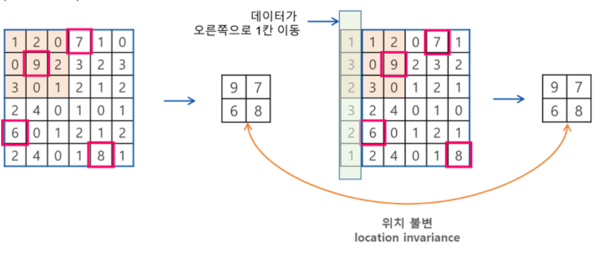

# 김인호.md

담당 : backend, 명세서 구현

## 명세서 구현

명세서 과제 : 이미지를 설명하는 캡션을 생성하는 것

이미지를 해석하는(특성을 뽑아내는) 모델로부터 특성을 받고, 그것을 텍스트 모델에 전달하여 이미지를 묘사하는 텍스트를 생성하게 된다.

이미지 해석, 텍스트 생성 은 하나로서 움직이는 것이 아니라 **독립적으로** 움직인다는 것이다!!

그러므로 이미지를 해석하는데 최적화된 CNN 신경망, 

텍스트로서 의미있는 문장을 만들어 내기 위한 RNN 신경망을 사용할 것이다.

텍스트 모델이 따로 있는 이유는 무엇인가, 


이 모델로 부터 남자, 빨간옷, 바다, 파도, 서핑 등의 특성은 추출 가능하지만, 이것이 이미지를 설명하는 **문장**은 될 수 없다.

그래서 이것으로 설명하는 문장을 생성하는 것이 텍스트 모델의 역할인 것 같다.


### Req 1-1

이미지파일 경로를 바탕으로 실제 이미지 데이터를 리턴한다.

이미지 크기를 통일해주는데, 변수로서 x_size, y_size ( 기본값 : 512) 를 받는다.

### Req 1-2

1-1에서 받은 이미지 데이터가 정규화되어있지 않은경우 정규화하여 불러온다.

그럼 정규화되있다는거는 어떻게 기억하는 것인가 따로 불러올때 table에 저장해야 한다는 것인가

그럼 정규화 되있는 파일도 따로 저장하고 불러와야겠네?

```python
if 파일 정규화(true):
    정규화된 파일 디렉토리에서 해당 파일을 가져온다.
else:
    load한 파일을 정규화 한 후, 정규화여부 table의 값을 true로 바꾸고, 정규화 파일 디렉	   토리에 파일을 저장한다.
```

이렇게 하면 되는건가

미안하다 담주부터 제대로 해보자


## CNN (Convolutional Neural Network)

**이미지 해석**에 최적화된 신경망

인간이 시각적으로 사물을 인식하는 과정은 시각 피질 안의 뉴런들이 시각적 정보에 대해 부분마다 다른반응을 보였는데, 어떤 것은 수직선, 다른것은 각도의 선에 반응하고, 어떤 것은 단순한 패턴 등에만 반응한다. 뉴런의 반응 영역은 서로 겹칠 수 있다.

결론적으로 고수준의 뉴련은 저수준의 뉴런의 출력을 받아 자극에 대한 반응을 확장해나간다는 것이다.

이러한 원리를 실현한 것이 바로 합성곱 신경망(CNN)이다.

CNN의 구조는 완전연결 계층과는 다르게 **합성곱층(covolutional layer) 과 풀링층(pooling layer)** 로 나눠져 있다.

### 완전연결 계층의 문제점

기존의 완전연결 계층층(fully connected layer)은 데이터셋을 분류하는 모델을 만들 때 3차원의 데이터( 가로, 세로좌표  + RGB값)을 입력층(input layer)에 넣어주기 위해 3차원 > 1차원의 평평한 데이터로 펼쳐줘야 했다.

그러니까 (28, 28, 1) 의 데이터가 있었다면 그것을 28 * 28 * 1 = 784의 데이터로 바꾼 뒤 넣어줘야했다.



핵심문제점은 데이터의 형상이 무시된다는 것이다. 3차원 이미지 데이터는 가로, 세로, 채널 의 형상을 가지는데( 공간적 구조), 이런 구조를 통해 픽셀들이 멀리, 가까이 있는 등의 관계를 표현할 수 있었다. 하지만 이걸 784라는 숫자로 바꾼다? 999 라는 숫자와 무슨 차이가 있는지 아무것도 설명할 수 없다.

### 합성곱층

입력 데이터의 형상을 유지한다. **3차원의 이미지를 그대로 입력할 수 있다는 것이다.**

그럼으로서 출력 또한 3차원으로 가능하다. 이것이 뜻하는 것은, 여러개의 층이 서로 입력과 출력을 주고 받을 수 있다는 말이 된다.

그렇게 됨으로서 CNN에서는 이미지 데이터처럼 **형상을 가지는 데이터**를 제대로 학습할 가능성이 높아졌다.

합성곱층의 뉴런은 한번에 모든 픽셀에 연결되는 것이 아니라, 각각의 수용영역을 가지고 있고, 그 안에 있는 픽셀에만 연결된다.

그렇게 됨으로서 [저수준 특성  > 고수준 특성]  으로 조합해 나가게 되는 것이다.



이때, 수용영역을 합성곱층에서 필터(filter) 또는 커널(kernel)이라 부른다.

이 필터가 가중치 파라미터(W)에 해당, **학습단계에서 적절한 필터를 찾도록 학습된다.**



그럼 필터는 대체 뭘 하는애인가 미리 있는 형태 같은 것인가 

#### 패딩(padding)

패딩(Padding)은 합성곱 연산을 수행하기 전, 입력데이터 주변을 특정값으로 채워 늘리는 것을 말한다. 패딩(Padding)은 주로 출력데이터의 공간적(Spatial)크기를 조절하기 위해 사용한다. 패딩을 할 때 채울 값은 hyper-parameter로 어떤 값을 채울지 결정할 수 있지만, 주로 **zero-padding**을 사용한다. 



패딩을 사용하는 이유는 패딩을 사용하지 않을 경우, 데이터의 Spatial 크기는 Conv Layer를 지날 때 마다 작아지게 되므로, 가장자리의 정보들이 사라지는 문제가 발생하기 때문에 패딩을 사용하며, 주로 합성곱 계층의 출력이 **입력 데이터의 공간적 크기와 동일하게 맞춰주기 위해 사용**한다.

#### 스트라이드(Stride)

스트라이드는 입력데이터에 필터를 적용할 때 이동할 간격을 조절하는 것, 1과 같이 작은 값이 더 잘 작동한다.



#### 텐서플로에서의 합성곱층

```python
tf.nn.conv2d(
    input,
    filter,
    strides,
    padding,
    use_cudnn_on_gpu=True,
    data_format='NHWC',
    dilations=[1, 1, 1, 1],
    name=None
)
# 다음과 같은 인자가 있어야 하며
filter = tf.get_variable(name='W1', shape=[3, 3, 1, 32],  # [FH, FW, in_ch, out_ch]
                         initializer=tf.contrib.layers.xavier_initializer_conv2d())
conv = tf.nn.conv2d(inputs, filter, strides=[1, 1, 1, 1], padding='SAME')

# filter 객체를 미리 4D 형태로 만들어줘야한다.


tf.layers.conv2d(
    inputs,
    filters,
    kernel_size,
    strides=(1, 1),
    padding='valid',
    data_format='channels_last',
    dilation_rate=(1, 1),
    activation=None,
    use_bias=True,
    kernel_initializer=None,
    bias_initializer=tf.zeros_initializer(),
    kernel_regularizer=None,
    bias_regularizer=None,
    activity_regularizer=None,
    kernel_constraint=None,
    bias_constraint=None,
    trainable=True,
    name=None,
    reuse=None
)
# filter 를 만들필요가 없이 바로 합성곱층을 구현할 수 있다.

# 출처: https://excelsior-cjh.tistory.com/180 [EXCELSIOR]

```


### 풀링층

기술적 설명 : 차례로 처리되는 데이터의 크기를 줄임, 이 과정으로 모델의 전체 매개변수의 수를 줄일 수 있다.

* max-poolin : 해당영역에서 최대값 찾기
* average-poolin : 해당영역의 평균값 계산

이미지 인식 분야에서는 주로 max-poolin 을 사용한다.



스트라이드를 2로 한 맥스풀링의 예

이론적 설명 : 계산된 특징은 이미지 내의 위치에 대한 변화에 영향을 덜 받기 때문이다.

ex 이미지의 우측 상단에서 눈을 찾는 특징은, 눈이 이미지 중앙에 있더라도 크게 영향을 받아서는 안된다.



데이터가 한칸씩 이동하더라도 맥스 풀링한 결과값은 변함이 없음을 확인할 수 있다.

#### 텐서플로에서의 풀링층

텐서플로에서는 [`tf.nn.max_pool()`](https://www.tensorflow.org/api_docs/python/tf/nn/max_pool)과 [`tf.layers.max_pooling2d()`](https://www.tensorflow.org/api_docs/python/tf/layers/max_pooling2d)을 사용해 Max-Pooling을 구현할 수 있으며, Average-Pooling의 경우 [`tf.nn.avg_pool()`](https://www.tensorflow.org/api_docs/python/tf/nn/avg_pool)과 [`tf.layers.average_pooling2d`](https://www.tensorflow.org/api_docs/python/tf/layers/average_pooling2d) 로 구현할 수 있다.

```python
tf.nn.max_pool(
    value,
    ksize,
    strides,
    padding,
    data_format='NHWC',
    name=None
)

tf.nn.max_pool(inputs, ksize=[1, 2, 2, 1], strides=[1, 2, 2, 1], padding='SAME')
# 예

```

ksize  :풀링 크기 지정 인자

```python
tf.layers.max_pooling2d(
    inputs,
    pool_size,
    strides,
    padding='valid',
    data_format='channels_last',
    name=None
)

tf.layers.max_pooling2d(inputs, pool_size=[2, 2], strides=[2, 2], padding='same')
# 이렇게 사용 가능
```


## RNN(Recurrent Neural Networks)

**텍스트, 자연어**와 같이 순서가 있는 데이터에 적합한 신경망